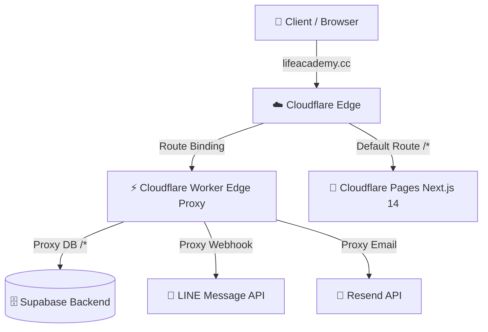

# 🚀 คู่มือการ Deploy Next.js บน Cloudflare Pages & Workers Edge Proxy
## สำหรับระบบ LIFE Academy (`lifeacademy.cc`)

คู่มือนี้จัดทำขึ้นโดยทีมงานเพื่อแนะนำขั้นตอนการตั้งค่าระบบ **Next.js 14** ร่วมกับ **Supabase, LINE API, Resend, และ Anthropic** เพื่อขึ้นระบบจริง (Production) บน **Cloudflare Pages** และขับเคลื่อนด้วย **Cloudflare Workers เป็น Edge Proxy** เพื่อความเร็วระดับมิลลิวินาที ความปลอดภัยสูงสุด และการจัดการ Webhook (เช่น LINE Webhook) ที่ไม่มีวันติด Cold Start

---

## 🗺️ 1. ภาพรวมสถาปัตยกรรม (Architecture Design)

การใช้ Cloudflare Workers เป็น Edge Proxy ควบคู่กับ Cloudflare Pages จะช่วยแก้ปัญหาระดับโปรเกรสซีฟดังนี้:
1. **Security & API Masking**: ซ่อน URL ของ Supabase/Resend ไม่ให้ Client รู้จักโดยตรง โดยวิ่งผ่าน `lifeacademy.cc/api/v1/db` แทน ป้องกันการแกะ API Key และการทำ DDoS
2. **LINE Webhook Optimization**: LINE API บังคับว่า Webhook ต้องตอบกลับ `200 OK` ภายใน 1 วินาที การเรียกผ่าน Next.js บน Cloudอาจเกิด Cold Start จนเกินเวลาได้ การใช้ Workers มารับและประมวลผลด่วนจะเสร็จภายใน `< 10ms` 
3. **Unified Custom Domain**: ทุกบริการ (Frontend, Database API, AI Chat, LINE Webhook) วิ่งภายใต้โดเมนเดียวคือ `lifeacademy.cc` ทำให้ไม่มีปัญหาเรื่อง CORS



---

## 🛠️ ขั้นตอนที่ 1: เตรียมโค้ด Next.js ให้พร้อมสำหรับ Cloudflare Pages

เนื่องจาก Cloudflare Pages ทำงานบน **Edge Runtime (workerd)** ไม่ใช่ Node.js Server แบบเดิม จึงต้องเตรียมโค้ดดังนี้:

### 1.1 ติดตั้ง Packages ที่จำเป็น
ติดตั้ง `@cloudflare/next-on-pages` เป็น devDependency ในโปรเจกต์:
```bash
npm install -D @cloudflare/next-on-pages vercel
```

### 1.2 ตั้งค่า Runtime ใน Code
ในไฟล์ API Route หรือ Page ที่มีการดึงข้อมูลแบบ Dynamic (เช่น ดึงจาก Supabase, เรียกใช้ Anthropic) ให้เพิ่มบรรทัดนี้ที่ด้านบนสุดของไฟล์เสมอ:
```typescript
export const runtime = 'edge';
```
*(ตัวอย่าง: `src/app/api/contact/route.ts` หรือ `src/app/api/booking/route.ts`)*

---

## 📑 ขั้นตอนที่ 2: ตั้งค่าบน Cloudflare Pages Dashboard

ตามภาพหน้าจอที่คุณได้เริ่มตั้งค่าไว้ ให้กรอกข้อมูลสำคัญดังนี้เพื่อป้องกันการ Build Error:

### 2.1 ข้อมูลการสร้าง (Build Settings)
*   **Framework preset**: เลือก `None`
*   **Build command**: 
    ```bash
    npx @cloudflare/next-on-pages
    ```
    *(คำสั่งนี้จะสั่ง `next build` ผ่านระบบจำลองของ Vercel แล้วแปลงไฟล์ทั้งหมดให้ทำงานบน Edge Container)*
*   **Build output directory**: 
    ```text
    .vercel/output/static
    ```

### 2.2 สิ่งสำคัญมาก: การตั้งค่า Environment Variables (กดเปิดแถบ Advanced)
ก่อนกด "Save and Deploy" ให้เข้าไปที่ส่วน **Environment variables (advanced)** แล้วเพิ่มตัวแปรนี้:
*   **Variable Name**: `NODE_VERSION`
*   **Value**: `20.14.0` *(หรือเวอร์ชันที่ตรงกับในเครื่องของคุณ เพื่อป้องกันเวอร์ชันเก่าเกินไปของ Cloudflare Build)*

### 2.3 ตั้งค่า Compatibility Flags (หลังจากสร้างโปรเจกต์เสร็จแล้ว)
เมื่อระบบสร้างโปรเจกต์เสร็จ ให้ไปที่หน้า **Settings > Functions > Compatibility Flags** ของโปรเจกต์ Pages นั้นแล้วตั้งค่า:
*   **Production compatibility flags**: เพิ่ม `nodejs_compat`
*   **Preview compatibility flags**: เพิ่ม `nodejs_compat`
*(จำเป็นอย่างยิ่งสำหรับโปรเจกต์ Next.js 14 เพื่อให้สามารถใช้ฟังก์ชัน Node.js พื้นฐานบางส่วนได้)*

---

## ⚡ ขั้นตอนที่ 3: ตั้งค่า Cloudflare Workers เป็น Edge Proxy

เราจะสร้าง Worker ขึ้นมาหนึ่งตัวเพื่อทำหน้าที่เป็น **Gateway / Edge Proxy** สำหรับบริการภายนอกทั้งหมด

### 3.1 สร้างโปรเจกต์ Worker บนเครื่องของคุณ
เปิด Terminal ในโฟลเดอร์อื่นหรือติดตั้งแยกภายนอก:
```bash
npm create cloudflare@latest lifeacademy-edge-proxy
# เลือก Hello World Worker (TypeScript)
```

### 3.2 ตัวอย่างโค้ด Edge Proxy ใน `src/index.ts`
ใช้โค้ดตัวอย่างด้านล่างนี้เพื่อกรองและส่งต่อ Request ไปยัง Supabase, LINE, หรือ Resend โดยอัตโนมัติ:

```typescript
export interface Env {
  // บันทึก Keys ต่างๆ ไว้ใน Cloudflare Secrets (ห้าม Hardcode ในโค้ด!)
  SUPABASE_URL: string;
  SUPABASE_ANON_KEY: string;
  SUPABASE_SERVICE_ROLE_KEY: string;
  RESEND_API_KEY: string;
  LINE_CHANNEL_ACCESS_TOKEN: string;
  LINE_CHANNEL_SECRET: string;
}

export default {
  async fetch(request: Request, env: Env, ctx: ExecutionContext): Promise<Response> {
    const url = new URL(request.url);
    const method = request.method;

    // ==========================================================
    // 🛡️ 1. Proxy Supabase API (ซ่อน URL และจัดการความปลอดภัย)
    // ==========================================================
    if (url.pathname.startsWith('/api/v1/db')) {
      const targetUrl = new URL(request.url);
      targetUrl.hostname = new URL(env.SUPABASE_URL).hostname;
      // แปลง path จาก /api/v1/db/... เป็น /rest/v1/... ของ Supabase
      targetUrl.pathname = url.pathname.replace('/api/v1/db', '/rest/v1');

      const headers = new Headers(request.headers);
      headers.set('Host', targetUrl.hostname);
      headers.set('apikey', env.SUPABASE_ANON_KEY);
      
      // หากไม่มี Auth header จากฝั่ง Client ให้แนบ Anon Key ไปอัตโนมัติ
      if (!headers.has('Authorization')) {
        headers.set('Authorization', `Bearer ${env.SUPABASE_ANON_KEY}`);
      }

      const proxyRequest = new Request(targetUrl.toString(), {
        method,
        headers,
        body: request.body,
        redirect: 'manual'
      });

      return fetch(proxyRequest);
    }

    // ==========================================================
    // 💬 2. Proxy LINE Webhook (ลด Latency และป้องกัน Timeout)
    // ==========================================================
    if (url.pathname === '/api/v1/line-webhook') {
      // 💡 LINE บังคับว่าต้องส่ง 200 OK กลับภายใน 1 วินาที
      // เราสามารถใช้ ctx.waitUntil เพื่อประมวลผล Logic หลังส่ง Response ได้!
      
      const bodyText = await request.text();
      
      // ประมวลผลทำงานเบื้องหลังโดยไม่บล็อกฝั่ง LINE
      ctx.waitUntil(
        handleLineEvents(bodyText, env)
      );

      return new Response('OK', { status: 200 });
    }

    // ==========================================================
    // 📧 3. Proxy Resend Email API (ส่งอีเมลแบบไร้รอยต่อจาก Edge)
    // ==========================================================
    if (url.pathname === '/api/v1/send-email') {
      if (method !== 'POST') {
        return new Response('Method Not Allowed', { status: 405 });
      }

      const headers = new Headers();
      headers.set('Content-Type', 'application/json');
      headers.set('Authorization', `Bearer ${env.RESEND_API_KEY}`);

      const proxyRequest = new Request('https://api.resend.com/emails', {
        method: 'POST',
        headers,
        body: request.body
      });

      return fetch(proxyRequest);
    }

    // ==========================================================
    // 📄 4. Fallback: ส่งต่อไปยัง Cloudflare Pages (Next.js Frontend)
    // ==========================================================
    // หากไม่ใช่ API หรือ Webhook ให้ดึงข้อมูลหน้าเว็บจาก Pages.dev มาแสดงผล
    const pagesUrl = new URL(request.url);
    pagesUrl.hostname = 'lifeacademy-cc.pages.dev'; // URL หน้าเว็บหลักของคุณ

    const proxyRequest = new Request(pagesUrl.toString(), request);
    return fetch(proxyRequest);
  }
};

// ฟังก์ชันรองรับการประมวลผลข้อความ LINE ด้านหลังฉาก
async function handleLineEvents(bodyText: string, env: Env) {
  try {
    const payload = JSON.parse(bodyText);
    for (const event of payload.events) {
      if (event.type === 'message' && event.message.type === 'text') {
        const replyToken = event.replyToken;
        const userText = event.message.text;

        // ตัวอย่าง: ตอบกลับด่วน หรือส่งเข้า Database ผ่าน Edge
        await sendLineReply(replyToken, `ได้รับข้อความ "${userText}" เรียบร้อยแล้วค่ะ ทางแอดมินกำลังดำเนินการประสานงานให้นะคะ`, env);
      }
    }
  } catch (err) {
    console.error('LINE Webhook Error:', err);
  }
}

async function sendLineReply(replyToken: string, text: string, env: Env) {
  await fetch('https://api.line.me/v2/bot/message/reply', {
    method: 'POST',
    headers: {
      'Content-Type': 'application/json',
      'Authorization': `Bearer ${env.LINE_CHANNEL_ACCESS_TOKEN}`
    },
    body: JSON.stringify({
      replyToken,
      messages: [{ type: 'text', text }]
    })
  });
}
```

### 3.3 บันทึก Secrets บน Cloudflare Workers
รันคำสั่งเหล่านี้เพื่อเซ็ตอัป API Keys และ URL สำคัญในระบบอย่างปลอดภัย:
```bash
npx wrangler secret put SUPABASE_URL
npx wrangler secret put SUPABASE_ANON_KEY
npx wrangler secret put RESEND_API_KEY
npx wrangler secret put LINE_CHANNEL_ACCESS_TOKEN
npx wrangler secret put LINE_CHANNEL_SECRET
```

---

## 🌐 ขั้นตอนที่ 4: การเชื่อมต่อ Custom Domain และตั้งค่า Routing (Edge Router)

เมื่อคุณเชื่อมต่อโดเมน `lifeacademy.cc` เข้ากับ Cloudflare DNS เรียบร้อยแล้ว ให้ใช้วิธี **Route Binding** ซึ่งเป็นวิธีที่ดีที่สุดและฟรีในการกระจายงาน:

1. **ตั้งค่าโดเมนให้ชี้ไปที่ Pages**:
   * ไปที่หน้า **Pages > Custom Domains > Add Custom Domain**
   * กรอก `lifeacademy.cc` และยืนยันการตั้งค่า DNS อัตโนมัติ
   * ตอนนี้โดเมนหลักจะเข้าสู่หน้าเว็บ Next.js 14 ที่รันผ่าน Pages

2. **ตั้งค่าให้ Workers Intercept โดเมน**:
   * ไปที่หน้า **Workers & Pages > lifeacademy-edge-proxy (ตัว Worker ของคุณ) > Settings > Triggers**
   * ในส่วน **Custom Domains** ให้กด **Add Custom Domain** แล้วระบุ `lifeacademy.cc` เท่านั้น
   * *ทางเลือกเสริม (หากต้องการประหยัดทรัพยากร)*: คุณสามารถผูกในช่อง **Routes** แทน โดยผูกไปที่ `lifeacademy.cc/api/*` เพื่อให้ Worker ทำหน้าที่เฉพาะการเป็น Proxy ส่วน Frontend ปล่อยให้ Cloudflare Pages จัดการโดยตรงผ่าน DNS ปกติ

---

## 💎 สรุปประโยชน์ของโซลูชันนี้ต่อ LIFE Academy
*   **ความเร็วระดับมิลลิวินาที (Near Zero Latency)**: เนื่องจากหน้าเว็บถูกแปลงเป็น Edge Workers และตัว Edge Proxy เองรันอยู่ที่ DNS ระดับโลก ทำให้อีเมล, ข้อความ LINE, และการดึง Database ทำงานเสร็จก่อนเข้าสู่ Server หลัก ช่วยเพิ่ม User Experience อย่างมหาศาล
*   **ปลอดภัยสูง**: ป้องกันการโดนดึง Supabase URL/Anon Key ไปดึงข้อมูลหรือถล่มใช้งานฟรี ลดโอกาสโดน Spam บัญชีดำจาก Resend หรือ LINE Messaging API
*   **ประหยัดสุดขีด**: บริการทั้งหมดอยู่บน Cloudflare Free Tier เป็นหลัก รองรับ Request หลายแสนครั้งต่อวันได้โดยแทบไม่มีค่าใช้จ่ายเพิ่มเติม
